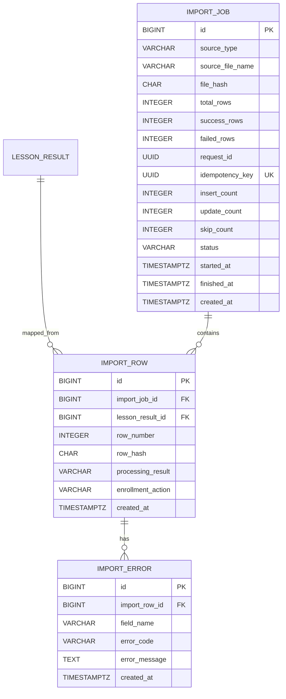

# Import Audit ERD source

이 문서는 `sql/schema_postgresql.sql`의 Import Audit 영역을 표현합니다. 공개 API는 건수·상태·시각만 반환하며 파일명, 해시, 요청 키와 행 데이터는 반환하지 않습니다.

```mermaid
erDiagram
    IMPORT_JOB {
        BIGINT id PK
        VARCHAR source_type
        VARCHAR source_file_name
        CHAR file_hash
        INTEGER total_rows
        INTEGER success_rows
        INTEGER failed_rows
        UUID request_id
        UUID idempotency_key UK
        INTEGER insert_count
        INTEGER update_count
        INTEGER skip_count
        VARCHAR status
        TIMESTAMPTZ started_at
        TIMESTAMPTZ finished_at
        TIMESTAMPTZ created_at
    }
    IMPORT_ROW {
        BIGINT id PK
        BIGINT import_job_id FK
        BIGINT lesson_result_id FK
        INTEGER row_number
        CHAR row_hash
        VARCHAR processing_result
        VARCHAR enrollment_action
        TIMESTAMPTZ created_at
    }
    IMPORT_ERROR {
        BIGINT id PK
        BIGINT import_row_id FK
        VARCHAR field_name
        VARCHAR error_code
        TEXT error_message
        TIMESTAMPTZ created_at
    }
    LESSON_RESULT ||--o{ IMPORT_ROW : mapped_from
    IMPORT_JOB ||--o{ IMPORT_ROW : contains
    IMPORT_ROW ||--o{ IMPORT_ERROR : has
```
